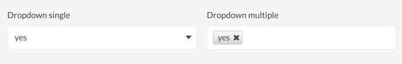
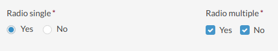

# Table of Contents

 - [Single Line Text](#single-line-text)
 - [Paragraph Text](#paragraph-text)
 - [Email](#email)
 - [Dropdown](#dropdown)
 - [Radio button](#radio-button)
 - [Hidden](#hidden)
 
## Single Line Text

Simple input field rendered as a one-line text field.

Does not have any type-specific options.

`<input type="text">`

## Paragraph Text

Multi-line text input.

Does not have any type-specific options.

`<textarea></textarea>`

## Email

Input field for these that should contain an email address. It is automatically validated in order to 
do not allow to fill non-valid emails.

Does not have any type-specific options.

`<input type="email">`

## Dropdown

Select element with a drop-down list of options.

Type-specific options

| Field                 | Description     |
|-----------------------|------------------------------------------|
| Choices               | Array of options where `Name` is an item's label and `Value` is a value stored in a database.               |
| Multiple              | Specifies whether user is able to select multiple values or just one option. See difference in the image below.              |
| Placeholder Text      | Specifies a short hint that describes the expected value of a `Choice` field. It works with e.g. Dropdown and Radio button fields. |

> Dropdown fields are being automatically rendered as [select2](https://select2.org/) widgets

## Radio button

Type-specific options

| Field                 | Description     |
|-----------------------|------------------------------------------|
| Choices               | Array of options where `Name` is an item's label and `Value` is a value stored in a database.               |
| Multiple              | Specifies whether user is able to select multiple values or just one option. See difference in the image below.              |
| Placeholder Text      | Specifies a short hint that describes the expected value of a `Choice` field. It works with e.g. Dropdown and Radio button fields. |

When `Multiple` option is checked, field will be rendered as `<input type="radio">`.

When `Multiple` option is unchecked, field will be rendered as `<input type="checkbox">`.

## Hidden

> Caution! Hidden field is not visible at the form view page! You can see a field definition only in the fields grid.

Type-specific options

| Field                  | Description                                      |
|----------------------- |--------------------------------------------------|
| Data value             | Default value that will be stored in a field.    |

`<input type="hidden">`
