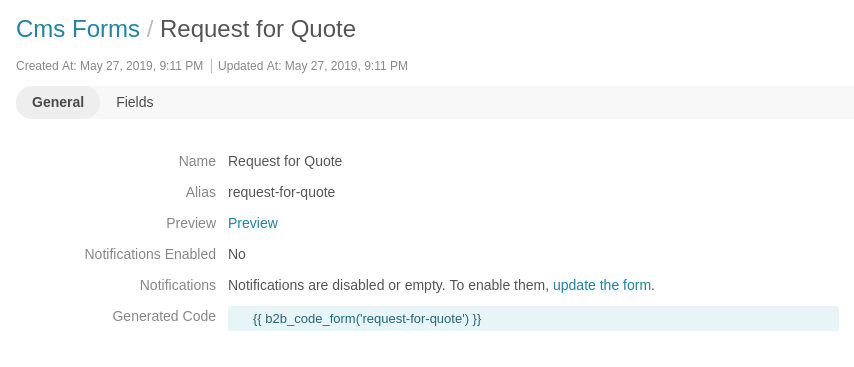

# Table of Contents

 - [Features](#features)
    - [Export responses](#export-responses)
 - [How to](#how-to)
     - [How to create your first form](#how-to-create-your-first-form)
     - [How to use form preview](#how-to-use-form-preview)
     - [How to embed form in a landing page](#how-to-embed-form-in-a-landing-page)
     - [How to style your form with additional css](#how-to-create-your-first-form)
 
# Features

## Export responses

Go to the Marketing > Cms Forms and open a form view page. Then, click on Responses button and Export.

CSV file has a following structure:

| ID | Form Alias   | Field response x Field Name | Field response x Value | 
|--- |--------------|-----------------------------|------------------------|
| 1  | contact-form |   Name                      | John Doe               | 

Where `x` is an integer representing number of a field. E.g. if form has 2 fields, it would be (1,2).

In the future releases `Field response x Field Name` will be changed to the actual name of a field.

# How to

## How to create your first form

First, go to the Marketing > CMS Form. At the index page with a forms grid, there's a button "Create CMS Form". 
Once clicked, you will be redirected to the form create page.

| Field                 | Description                                                                               |
|-----------------------|-------------------------------------------------------------------------------------------|
| Name                  | Name of a form.                                                                                          |
| Alias                 | Alias is used to refer to a specific form in Landing Pages/Content Blocks (e.g. b2b_code_form('request-for-quote') ). This value is auto-generated based on a name of a form. Must be unique.                                                                                         |
| Preview Enabled       | When preview is enabled, a special link is auto-generated and the form is accessible via this link. Very useful when drafting the form to easily share it with your team.                                                                                          |
| Notifications Enabled | When notifications are enabled and at least one email is defined, you'll get an email on every form response.                                                                                          |
| Notifications         | Collection of email notifications configuration. Used to send an email message when someone submits your form.  You can specify an email and alternatively custom email template. When template is blank, default one will be used (B2bCodeCmsFormBundle:response_received) |


Now, you can add form fields.


| Field                  | Description                                                                               |
|----------------------- |-------------------------------------------------------------------------------------------|
| Label                  | Label of a field. This value will be displayed to users next to the field.                |
| Name                  | Similar to "alias" field in a form, this field is used to refer to a specific Field entity in a form. This value is auto-generated based on a label of a Field. Must be unique across the form.                                                                           |
| Type                  | Type of a field, e.g. Single Line Text or Dropdown                                                                          |
| Field Size                  | Controls appearance of the field. Forms are rendered based on the standard OroCommerce 12-columns grid system. Possible values of a grid column are: SMALL - 3, MEDIUM - 6, LARGE - 12. Small takes 1/4 of the row size, medium 1/2 and large - whole row.                                                                           |
| Placeholder Text             | Specifies a short hint that describes the expected value of an input field. Note: It works only with plain input fields (doesn't work with e.g. Dropdown)                                                                           |
| Css Classes             | Optional CSS classes that will be added to the field. Must be separated by space. Useful when Web developer provides standard set of form CSS classes and give the full control of using them to the end user.                                                                           |
| Required             | Whether a field is optional or not.                                                                          |
| Type-specific options             | Options that depend on a selected field type. Learn more in [field types documentation](./field_types.md).                                                                         |


Field preview

Preview is being refreshed automatically on every attribute change if both name and type attributes are valid. This is just an example to show how different attributes affect field appearance. The final result may (and will) vary depending on css styles applied on the storefront.

## How to use form preview

First, make sure that "Preview enabled" checkbox is enabled. Go to form view page and click on "Preview".



New tab opens with a preview of the form. Here you can see how you form will look like at the storefront.

## How to embed form in a landing page

Go to form view page and copy "Generated code" value. Based on the example above, it'd be `{{ b2b_code_form('request-for-quote') }}`.

Then, go to Marketing > Landing Pages and create a new one. In the content, paste generated code and Save.
Example from the demo data:
```html
<div class="grid contact-us-form">
    <div class="grid__row">
        <div class="grid__column grid__column--6">
            
        </div>
        <div class="grid__column grid__column--6">{{ b2b_code_form("feedback-form") }}</div>
    </div>
</div>
```


## How to style your form with additional css

TBD. This feature is planned for the next release.
